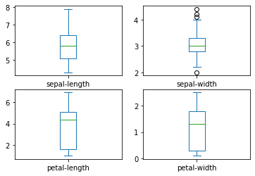
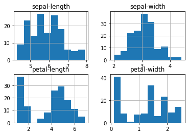
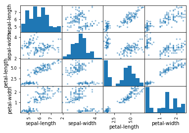
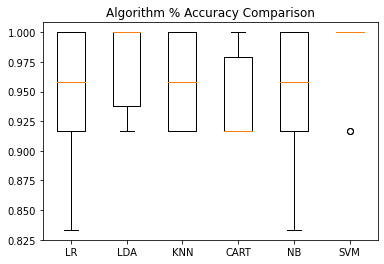

# iris-flower-machine-learning

Statistical classification of [Iris flowers](https://raw.githubusercontent.com/jbrownlee/Datasets/master/iris.csv) using machine learning with Python and Jupyter Notebook.

- [source](https://machinelearningmastery.com/machine-learning-in-python-step-by-step/)
- [potential other source](https://medium.com/gft-engineering/start-to-learn-machine-learning-with-the-iris-flower-classification-challenge-4859a920e5e3)

## Results

Box and whisker plots for the [Iris flowers dataset](https://raw.githubusercontent.com/jbrownlee/Datasets/master/iris.csv), showing the distribution for each measurement:



Histograms of [Iris flowers dataset](https://raw.githubusercontent.com/jbrownlee/Datasets/master/iris.csv), with sepal length and width showing Gaussian distributions:



Scatterplots of the [Iris flowers dataset](https://raw.githubusercontent.com/jbrownlee/Datasets/master/iris.csv) attrbutes, with diagonal groupings indicating high correlations and predictable relationships:



Accuracy comparison across 6 models, based on stratified 10-fold cross validation on the [Iris flowers dataset](https://raw.githubusercontent.com/jbrownlee/Datasets/master/iris.csv):



Winners:

- Linear Discriminant Analysis (LDA)
- Support Vector Machines (SVM)

At the end of the script, ML predictions are made using SVM.

Accuracy Score:

```bash
0.9666666666666667
```

Confusion Matrix, showing indications of any errors made:

```bash
[[11  0  0]
 [ 0 12  1]
 [ 0  0  6]]
```

Classification Report, showing excellent results for each class:
```bash
                 precision    recall  f1-score   support

    Iris-setosa       1.00      1.00      1.00        11
Iris-versicolor       1.00      0.92      0.96        13
 Iris-virginica       0.86      1.00      0.92         6

       accuracy                           0.97        30
      macro avg       0.95      0.97      0.96        30
   weighted avg       0.97      0.97      0.97        30
```

## Localhost Setup

### Install Python and pip

In Ubuntu:

```bash
# Upgrade apt
sudo apt update
sudo apt -y upgrade

# Install python, pip, virtual env, and others
python3 -V
sudo apt install -y python3 python3-pip python3-venv
sudo apt install -y build-essential libssl-dev libffi-dev python3-dev
```

### Setup Virtual Environment

```bash
# Clone this repo
git clone git@github.com:bill-c-martin/iris-flower-machine-learning.git

# Enter repo and setup a virtual env
cd iris-flower-machine-learning
python3 -m venv venv

# Activate the virtual environment
source venv/bin/activate

# Test Python and pip are working:
python -V
pip -V

# Install packages through pip:
python -m pip install numpy scipy matplotlib ipython jupyter pandas sympy nose sklearn
```

To exit the virtual environment:

```bash
deactivate
```

### Verify Installed Packages

To check the pip packages installed in the previous step, run this from the repo root:

```bash
source venv/bin/activate
python check-packages.py
```

It should print out something similar to:

```bash
Python: 3.8.10 (default, Nov 26 2021, 20:14:08)
[GCC 9.3.0]
scipy: 1.8.0
numpy: 1.22.2
matplotlib: 3.5.1
pandas: 1.4.1
sklearn: 1.0.2
```

### Run in VS Code

1. Install VS Code
2. Install the [Microsoft Python Extension](https://marketplace.visualstudio.com/items?itemName=ms-python.python)
3. Open this repo in VS Code
4. Double click `index.ipynb`
5. Click "Run"

This will run `index.py` in a Jupyter Notebook, so that generated plots and graphs can be seen.

